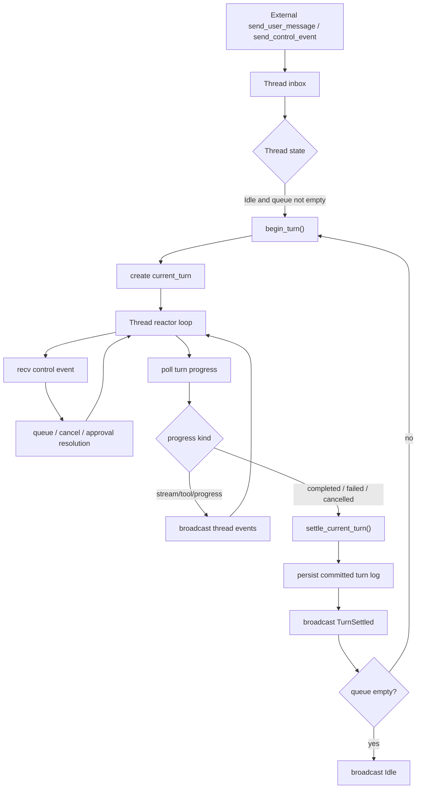

# Thread Reactor Design

**Date:** 2026-04-02

**Goal:** Collapse the current `spawn_runtime_actor + Arc<RwLock<Thread>> + spawned Turn task` model into a single-thread-owned reactor where `Thread` is the only mutable coordinator and `Turn` becomes an execution state object with read-only access to shared thread behavior.

## Summary

Today the runtime path is split across three places:

- `Thread` owns durable conversation state and turn-settling behavior.
- `runtime.rs` owns queueing, cancellation, and lifecycle orchestration.
- `Turn` owns enough copied state to execute independently after `Thread` releases its lock.

That split created duplicated read logic, channel indirection, and event-order races such as `Idle` being observed before `TurnSettled`. This design replaces that structure with a single `Thread` reactor loop that receives control events, advances the active turn, settles results, persists committed logs, and emits events in one ordered path.

## Goals

- Make `Thread` the single mutable owner of thread runtime state.
- Let `Turn` reuse shared thread read behavior directly instead of receiving duplicated snapshots.
- Remove the extra spawned turn task and the `runtime.rs` actor layer.
- Reduce locking and channel handoff complexity.
- Preserve committed turn log semantics: only settled turn messages are persisted.
- Preserve external compatibility for thread snapshots and event subscribers.

## Non-Goals

- Reworking the persisted turn-log format introduced by `messages.jsonl + meta.json`.
- Changing the external `ThreadEvent` protocol beyond ordering guarantees already implied by the current design.
- Adding retry-or-repair flows for persistence failures.

## Current Problems

### Split ownership

`Thread`, `runtime.rs`, and `Turn` all own part of the turn lifecycle. That means queue state, turn state, completion handling, and event emission are coordinated across task boundaries instead of one sequential path.

### Duplicated shared reads

`Thread::build_turn()` rebuilds turn context, tools, and hooks, while `Turn` also keeps its own shared history and message materialization path. The code is logically coupled but structurally split.

### Event ordering races

Because turn execution and turn settlement happen in different tasks, events such as `Idle` and `TurnSettled` can be emitted from different places. This previously caused job runtime cooling to race ahead of turn settlement.

### Locking and ownership scaffolding

Several fields exist only to let a separate runtime actor own or temporarily borrow thread state:

- `Arc<RwLock<Thread>>`
- `mailbox: Arc<Mutex<ThreadMailbox>>`
- `take_control_rx()`
- `spawn_runtime_actor()`
- `ThreadRuntime` and `ThreadRuntimeAction`
- `Turn` fields that duplicate thread-owned shared state

## Proposed Architecture

### Core model

`Thread` becomes the single runtime coordinator. It owns:

- committed turn history
- current in-flight turn state
- inbox / mailbox state
- control receiver
- persistence and event emission
- shared read-only dependencies such as provider, tools, hooks, plan store, and compaction checkpoint

`Turn` becomes an execution-state object that can read shared thread behavior but does not own thread lifecycle decisions.

Conceptually:

```rust
struct Thread {
    turns: Vec<TurnRecord>,
    current_turn: Option<InFlightTurn>,
    cached_committed_messages: Option<Arc<Vec<ChatMessage>>>,
    compaction_checkpoint: Option<CompactionCheckpoint>,
    inbox: VecDeque<ThreadControlEvent>,
    mailbox: ThreadMailbox,
    control_rx: mpsc::UnboundedReceiver<ThreadControlEvent>,
    pipe_tx: broadcast::Sender<ThreadEvent>,
    provider: Arc<dyn LlmProvider>,
    tool_manager: Arc<ToolManager>,
    hooks: Option<Arc<HookRegistry>>,
    compactor: Arc<dyn Compactor>,
    plan_store: FilePlanStore,
    ...
}

struct Turn<'a> {
    thread: &'a Thread,
    turn_number: u32,
    pending_messages: Vec<ChatMessage>,
    cancellation: TurnCancellation,
    state: TurnPhase,
}
```

Implementation detail: Rust may require the execution object to hold a smaller read-only view rather than a raw `&Thread` across `await` points. That is acceptable as long as the architecture remains “Thread owns mutable coordination; Turn reads shared thread behavior.”

### Reactor loop

`Thread` runs a single `tokio::select!` loop that waits for:

- incoming control events
- progress from the active turn

The loop owns the order of:

1. dequeueing work
2. starting a turn
3. handling progress events
4. settling the turn
5. persisting committed logs
6. emitting `TurnSettled`
7. going `Idle` or immediately starting the next turn

### Turn progress contract

`Turn` no longer returns a single `TurnOutput` after running to completion in a detached task. Instead it yields progress to `Thread`, for example:

- `Processing`
- `ToolStarted`
- `ToolCompleted`
- `WaitingForApproval`
- `Completed`
- `Failed`
- `Cancelled`

`Thread` remains the only component that turns those terminal outcomes into authoritative history changes.

## Data Flow



## Field Changes

### Thread fields to keep

- `turns`
- `current_turn`
- `cached_committed_messages`
- `compaction_checkpoint`
- `next_turn_number`
- `pipe_tx`
- `control_tx`
- `control_rx`
- `mailbox` or an equivalent in-thread queue structure
- `provider`
- `tool_manager`
- `hooks`
- `compactor`
- `plan_store`

### Thread fields or APIs to remove

- `turn_running`
- `take_control_rx()`
- `spawn_runtime_actor()`
- `mailbox: Arc<Mutex<ThreadMailbox>>`
- `control_rx: Option<_>`
- `runtime.rs` state-holder types that only exist to bridge ownership

### Turn fields to remove or fold back into Thread

- `messages`
- `tools`
- `hooks`
- `thread_event_tx`
- `control_tx`
- `mailbox`
- `_forwarder_handle`

`Turn` should keep only per-turn execution state and use thread-owned shared behavior for reads.

## Event Ordering

The reactor loop must guarantee this terminal ordering for a settled turn:

1. terminal turn outcome observed
2. `settle_current_turn()`
3. committed turn log persistence attempted
4. `ThreadEvent::TurnSettled`
5. either next turn starts or `ThreadEvent::Idle`

This removes the existing cross-task race where `Idle` could be observed before authoritative settlement.

## Cancellation, Approval, and Shutdown

### New user message

- If the thread is idle, it may start immediately.
- If a turn is already running, it is only queued.

### Cancellation

- `UserInterrupt` marks the active turn as cancelled.
- `Thread` does not settle immediately on interrupt.
- Settlement only happens after the turn yields a terminal cancelled outcome.

### Approval

- When a turn needs approval, it yields `WaitingForApproval`.
- `Thread` stores that phase and continues receiving control events.
- Approval resolution is fed back into the active turn and execution resumes.

### Shutdown

- If idle, `Thread` exits immediately.
- If running, `Thread` cancels the current turn and exits only after the turn settles.

## Persistence

Committed log persistence stays unchanged in format:

- `turns/<n>.messages.jsonl`
- `turns/<n>.meta.json`

Persistence is attempted only after the turn settles in memory.

If persistence fails:

- the thread state is not rolled back
- a warning is emitted
- recovery / retry is explicitly deferred

## Compatibility

The design keeps these existing compatibility surfaces:

- flat history snapshots derived from committed turn history
- current `ThreadEvent` consumers in session, job, and desktop layers
- committed turn log recovery path

The main change is internal ownership and event sequencing, not external protocol shape.

## Testing Strategy

### Core sequencing tests

- completed turn emits `TurnSettled` before `Idle`
- failed turn emits `TurnSettled` before `Idle`
- queued follow-up work starts only after prior settlement

### Queueing tests

- while a turn runs, additional user messages queue instead of starting concurrently
- queued job results can still be claimed without losing later user work

### Cancellation tests

- interrupting an active turn yields a cancelled settlement
- cancelled turns do not leave the reactor stuck

### Approval tests

- waiting-for-approval pauses execution without blocking control intake
- approval resolution resumes the same turn

### Persistence tests

- only settled turns are written to `messages.jsonl + meta.json`
- persistence failure does not roll back committed in-memory state

### Regression tests

- preserve snapshot compatibility across session and job recovery
- keep `execute_job_respects_thread_pool_capacity` green to guard against the prior event-order race

## Migration Plan Summary

1. Move runtime state-machine logic from `runtime.rs` into `thread.rs` while keeping the public thread API stable.
2. Convert `Turn::execute()` into a progress-yielding state machine.
3. Remove detached turn execution and the extra spawned task.
4. Fold mailbox and control ownership back into `Thread`.
5. Delete the obsolete runtime layer and its tests.

## Recommendation

Proceed with the refactor in small verified steps. The goal is not just fewer types; it is restoring a single authoritative execution path so state, persistence, and emitted events all happen in one place.
