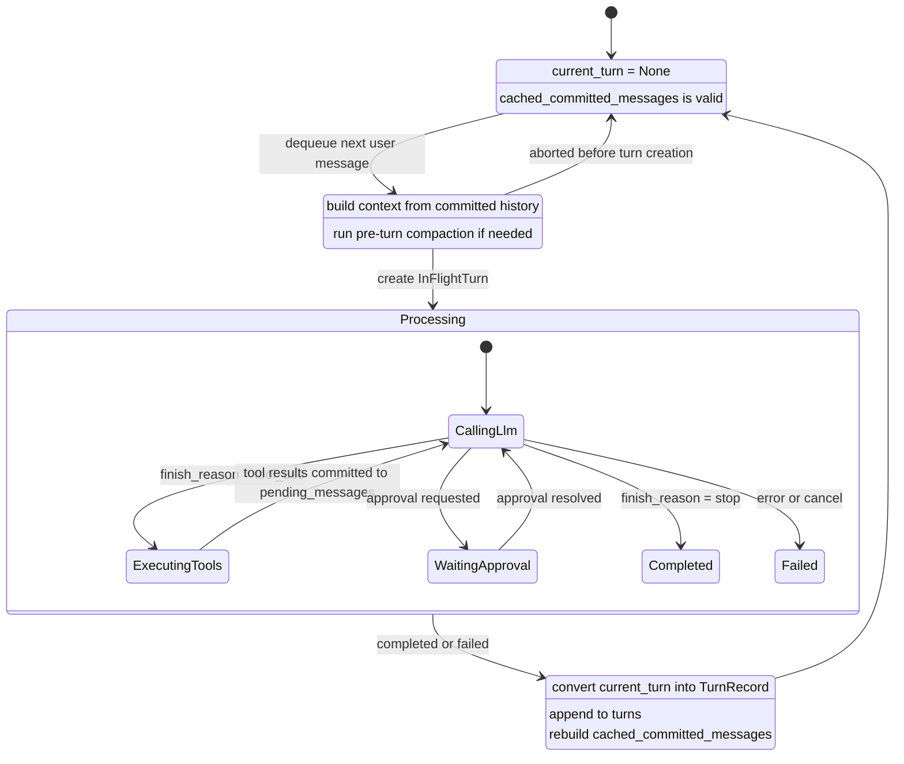

# Thread Turn History Design

Date: 2026-04-02
Branch: `codex/turn-thread-shared-history`

## Context

The current thread model treats flattened `messages` as the authoritative state.
`turn_count`, trace recovery, compaction, and desktop snapshots all derive from or mutate that flat message list.

This creates three problems:

1. Turn structure is implicit instead of explicit.
2. Recovery rebuilds transcript state by replaying low-level events.
3. Compaction currently rewrites authoritative history, which mixes transcript truth with context optimization.

We want `Thread` to have an explicit turn-first model while keeping existing external snapshot APIs stable in the first stage.

## Goals

1. Make settled turns the authoritative conversation history.
2. Keep the "only one turn can run at a time" rule explicit in the model.
3. Preserve existing `messages`-based APIs through a derived compatibility cache.
4. Replace the event-heavy trace format with a simpler turn log: one committed `ChatMessage` per line.
5. Stop using compaction to rewrite authoritative transcript history.

## Non-Goals

1. Changing desktop snapshot payloads in the first stage.
2. Preserving partial streaming output as committed `ChatMessage` values.
3. Bulk-migrating all historical trace files up front.

## Chosen Approach

We will move to a thread model where:

- `system_messages` stores thread-level prompt history.
- `turns: Vec<TurnRecord>` stores the authoritative settled history.
- `current_turn: Option<InFlightTurn>` stores the single in-flight turn.
- `cached_committed_messages` stores a derived flattened view for hot-path compatibility.
- `CompactionCheckpoint` stores context optimization state separately from transcript truth.

External APIs will continue to expose flattened `messages` in the first stage, but those messages will be derived from settled turns instead of being the source of truth.

## Data Model

### Thread

```rust
Thread {
    id: ThreadId,
    session_id: SessionId,
    title: Option<String>,
    created_at: DateTime<Utc>,
    updated_at: DateTime<Utc>,

    system_messages: Vec<ChatMessage>,
    turns: Vec<TurnRecord>,
    current_turn: Option<InFlightTurn>,
    cached_committed_messages: Option<Arc<Vec<ChatMessage>>>,
    compaction_checkpoint: Option<CompactionCheckpoint>,

    provider: Arc<dyn LlmProvider>,
    tool_manager: Arc<ToolManager>,
    compactor: Arc<dyn Compactor>,
    mailbox: Arc<Mutex<ThreadMailbox>>,
    plan_store: FilePlanStore,
    next_turn_number: u32,
}
```

### Settled Turn

```rust
TurnRecord {
    turn_number: u32,
    state: TurnState,
    messages: Vec<ChatMessage>,
    token_usage: Option<TokenUsage>,
    started_at: DateTime<Utc>,
    finished_at: Option<DateTime<Utc>>,
    model: Option<String>,
    error: Option<String>,
}
```

`messages` contains only committed messages for that turn, in order.
It may contain multiple messages, for example:

1. user
2. assistant with tool calls
3. tool result
4. assistant final answer

### In-Flight Turn

```rust
InFlightTurn {
    turn_number: u32,
    state: InFlightTurnPhase,
    pending_messages: Vec<ChatMessage>,
    token_usage: TokenUsage,
    started_at: DateTime<Utc>,
    model: Option<String>,
}
```

`current_turn` exists only while the thread is processing.
There is never more than one in-flight turn.

### Compatibility Cache

```rust
cached_committed_messages: Option<Arc<Vec<ChatMessage>>>
```

This is not authoritative data.
It is a derived cache built from:

```rust
system_messages + flatten(turns[*].messages)
```

Rules:

1. It never includes `current_turn`.
2. It is invalidated whenever settled history changes.
3. It is rebuilt after `TurnSettled`.
4. It is read by compatibility APIs such as `history()` and `get_thread_snapshot()`.

### Compaction Checkpoint

```rust
CompactionCheckpoint {
    summarized_through_turn: u32,
    summary_messages: Vec<ChatMessage>,
    created_at: DateTime<Utc>,
}
```

This affects request context construction only.
It does not rewrite authoritative turn history.

## Thread State Machine



## Lifecycle Rules

1. `Idle` requires `current_turn == None`.
2. `Processing` requires `current_turn == Some(_)`.
3. Only settled turns live in `turns`.
4. Once `current_turn` exists, it must settle into a `TurnRecord`.
5. Partial streaming text is not committed as `ChatMessage`.
6. `turn_count` exposed externally remains `turns.len()`.
7. `next_turn_number` is separate from externally visible settled turn count.

## Compaction Design

Compaction no longer rewrites transcript history.

Instead:

1. `turns` remains the complete settled transcript.
2. `cached_committed_messages` remains the flattened settled transcript cache.
3. `compaction_checkpoint` stores synthetic summary messages for future request context construction.

Two read paths become explicit:

1. `history()` or `history_committed()`
   Returns the committed transcript from `cached_committed_messages`.
2. `build_turn_context()`
   Returns:
   `system_messages + checkpoint.summary_messages + materialized turns after checkpoint`

This preserves transcript truth while still letting compaction reduce context size.

## Logging Redesign

The old event-heavy per-turn JSONL trace becomes a simpler turn log.

Layout:

```text
{trace_dir}/{session_id}/{thread_id}/
  thread.meta.json
  checkpoints/
    latest.json
  turns/
    000001.messages.jsonl
    000001.meta.json
    000002.messages.jsonl
    000002.meta.json
```

### `thread.meta.json`

Stores thread-level metadata such as:

- `thread_id`
- `session_id`
- `created_at`
- `system_messages`

### `turns/<n>.messages.jsonl`

Each line is one committed `ChatMessage`.

Example:

```json
{"role":"user","content":"Search the latest AI news"}
{"role":"assistant","content":"I found the following news...","tool_calls":[...]}
{"role":"tool","content":"...","tool_call_id":"call_1","name":"web_search"}
{"role":"assistant","content":"Here is the summary."}
```

Only committed messages are written.
Streaming deltas are not part of the primary recovery format.

### `turns/<n>.meta.json`

Stores turn metadata such as:

- `turn_number`
- `state`
- `token_usage`
- `started_at`
- `finished_at`
- `model`
- `error`

### `checkpoints/latest.json`

Stores `CompactionCheckpoint`.
It is not part of the committed transcript.

## Failure and Cancellation Semantics

We chose the following rule:

- If a turn fails or is cancelled before a full `ChatMessage` is committed, partial output is discarded.

Implications:

1. `messages.jsonl` contains only committed messages.
2. Partial streaming output is not persisted as transcript.
3. Failure details live in `turn.meta.json`.
4. A created `current_turn` still settles into a `TurnRecord`, but that record may contain zero assistant output messages.

Suggested settled states:

```rust
enum TurnState {
    Completed,
    Failed,
    Cancelled,
}
```

## Recovery Strategy

Primary recovery path:

1. Read `thread.meta.json`.
2. Load turn numbers in order.
3. For each turn:
   - read `<n>.messages.jsonl`
   - read `<n>.meta.json`
   - construct `TurnRecord`
4. Rebuild `cached_committed_messages`.
5. Load optional `CompactionCheckpoint`.

Legacy fallback:

1. If new-format turn logs do not exist, read the old event-based `<n>.jsonl`.
2. Recover `TurnRecord` values from legacy logs.
3. Do not bulk-migrate old logs immediately.

This is a lazy migration strategy.

## Compatibility Plan

First stage compatibility rules:

1. `Thread::history()` continues to expose flattened `Vec<ChatMessage>` semantics.
2. `get_thread_snapshot()` continues to return:
   - `messages`
   - `turn_count`
   - `token_count`
   - `plan_item_count`
3. Desktop and chat-store protocol stays unchanged in stage one.
4. New internal APIs can be added for turn-first access without changing external callers yet.

Suggested new internal APIs:

```rust
fn turns(&self) -> &[TurnRecord];
fn build_turn_context(&self) -> Vec<ChatMessage>;
fn rebuild_cached_committed_messages(&mut self);
async fn recover_turns_from_log(...) -> Result<Vec<TurnRecord>>;
```

## Migration Plan

1. Add the new thread model fields and types.
2. Stop treating flattened `messages` as authoritative state.
3. Change `begin_turn()` to create `current_turn` instead of mutating committed history.
4. Change settlement to append a `TurnRecord` to `turns`.
5. Add `cached_committed_messages` rebuild logic.
6. Start writing new-format turn logs.
7. Add recovery that prefers new-format logs.
8. Keep legacy event-log fallback until migration is complete.
9. Remove obsolete trace event types only after recovery fallback is stable.

## Test Plan

### Unit Tests

1. `TurnRecord` flattening into `cached_committed_messages`
2. `current_turn` settlement into `turns`
3. cancellation and failure settlement behavior
4. compaction checkpoint not mutating committed transcript

### Recovery Tests

1. recover from `messages.jsonl + meta.json`
2. recover from legacy event logs
3. prefer new-format logs when both exist

### Integration Tests

1. `get_thread_snapshot()` remains behavior-compatible
2. tool-use turns preserve message order
3. cancelled turns do not persist partial assistant messages
4. desktop historical loading does not regress

### Regression Tests

1. compaction followed by continued conversation
2. recovery with missing or corrupt single-turn files produces clear errors

## Risks

1. Existing code paths assume authoritative flat message history.
2. Compaction code currently mutates history directly and will need careful separation.
3. Legacy recovery and new recovery must coexist during migration.
4. Turn numbering semantics must stay stable across activation and replay.

## Summary

The new design makes `turns` the source of truth, keeps the single in-flight turn explicit, preserves old `messages` APIs through a cache, separates compaction from transcript truth, and replaces event-heavy trace recovery with straightforward message-per-line logs.
